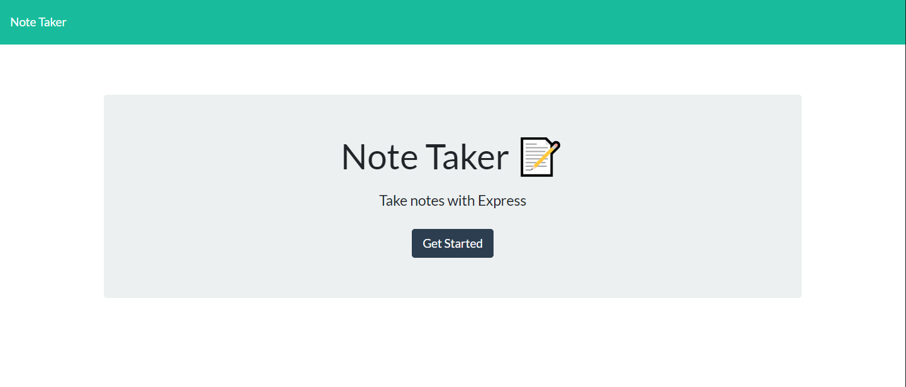
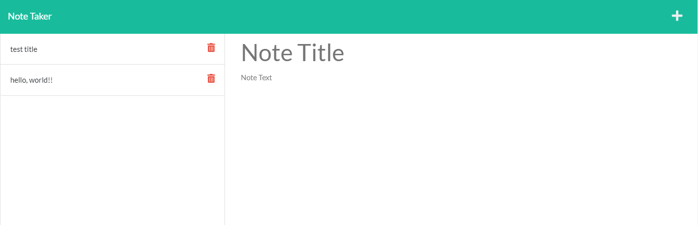

# Module #11 Challenge: Note Taker

## Description

This project is a **note taker application** that uses **Express.js** and the **short-unique-id** npm. The application saves, retrieves, and deletes note data from a JSON file.

[Check out the deployed application here!](https://tranquil-refuge-73733.herokuapp.com/)

## Table of Contents

* [Screenshots](#screenshots)
* [Credits](#credits)
* [Questions](#questions)

## Screenshots

## Credits

* Front-end starter code cloned from [here!](https://github.com/coding-boot-camp/miniature-eureka)

## Questions

If you have any questions about this repository, please open an issue. You can also find more of my work at [desguerra](https://github.com/desguerra) on GitHub.